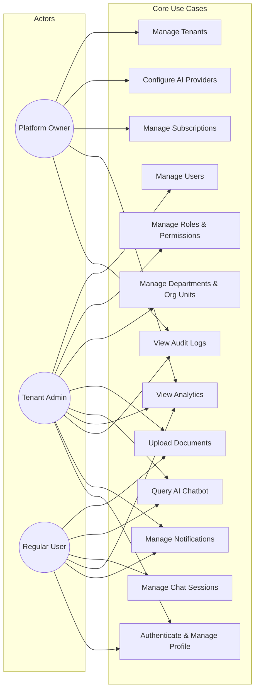

# Chapter 3: Analysis and Design (Part 1 — Requirements & Use Cases)

---

## 3.1 System Requirements

### 3.1.1 Functional Requirements

#### FR-01: Multi-Tenant User Management
- **FR-01.1**: The system shall support creation of isolated tenant organisations with unique domains.
- **FR-01.2**: Each tenant shall have an independent user namespace; email addresses are globally unique across all tenants.
- **FR-01.3**: Users shall be assigned to a single tenant; cross-tenant access is prohibited except for Platform Owners.
- **FR-01.4**: The system shall support a hierarchical organisational structure (companies → divisions → departments → teams) using the closure-table pattern.
- **FR-01.5**: Users may belong to multiple organisational units (`UserOrgUnit`) with time-bound membership.

#### FR-02: Dynamic Role-Based Access Control
- **FR-02.1**: Tenant administrators shall create custom roles without system code changes.
- **FR-02.2**: Roles shall support a parent–child hierarchy; child roles inherit all permissions of their ancestors.
- **FR-02.3**: Permission inheritance shall use the closure-table pattern (`RoleClosure`) for O(1) ancestor resolution.
- **FR-02.4**: Permissions shall follow a `resource_type × action` matrix (e.g., `document:upload`, `rag:query`, `user:create`).
- **FR-02.5**: The system shall support explicit deny rules that override any allow grants.
- **FR-02.6**: Permissions shall support ABAC conditions (e.g., `{"department": "own", "classification_level": {"lte": 3}}`).
- **FR-02.7**: Role assignments (`UserRole`) shall support optional `expires_at` timestamps for time-bound access.
- **FR-02.8**: System roles (`Tenant Administrator`) shall be auto-created per tenant and protected from deletion.

#### FR-03: Document Management
- **FR-03.1**: Users with `document:upload` permission shall upload files in PDF, DOCX, DOC, TXT, CSV, XLSX, PPTX, and Markdown formats.
- **FR-03.2**: The system shall validate file type by MIME inspection, not just extension.
- **FR-03.3**: Uploaded documents shall be processed asynchronously (Celery task) through the ingestion pipeline.
- **FR-03.4**: Documents shall have classification levels (0 = Unclassified, 1 = Internal, 2 = Confidential, 3 = Secret, 4 = Top Secret, 5 = Compartmented).
- **FR-03.5**: Documents shall have visibility types: `public` (all tenant users), `restricted` (explicit grants only), `private` (uploader only).
- **FR-03.6**: Document access grants shall support role-based, org-unit-based, and user-based grant types.
- **FR-03.7**: Org-unit grants shall optionally cascade to descendant units (`include_descendants` flag).
- **FR-03.8**: Document access grants shall support `permission_level` (read, write, manage).
- **FR-03.9**: The system shall support document versioning with immutable version snapshots.
- **FR-03.10**: Soft deletion shall hide documents from queries while retaining data for compliance.

#### FR-04: RAG Pipeline
- **FR-04.1**: The system shall extract text from supported document formats (PDF, DOCX, TXT).
- **FR-04.2**: Extracted text shall be cleaned (whitespace normalisation, null byte removal) and chunked using token-level segmentation (500 tokens per chunk, 50-token overlap) via the `cl100k_base` tokeniser.
- **FR-04.3**: Chunks shall be embedded using the configured embedding provider (SentenceTransformers, OpenAI, or HuggingFace).
- **FR-04.4**: Embeddings shall be stored in Qdrant with metadata payloads containing `tenant_id`, `document_id`, `department_id`, `classification_level`, and `chunk_index`.
- **FR-04.5**: Query-time vector search shall apply mandatory `tenant_id` and `document_id` filters.
- **FR-04.6**: The retriever shall over-fetch candidates (3× top_k) and re-rank using a hybrid score: `0.8 × semantic_score + 0.2 × lexical_overlap`.
- **FR-04.7**: The system shall expand retrieved chunks with ±1 surrounding chunks (context window) to improve answer coherence.
- **FR-04.8**: Follow-up queries with referential language ("what about this?") shall be rewritten by prepending the prior user message.
- **FR-04.9**: The LLM shall generate responses using a system prompt that enforces context-only answering and source citation.
- **FR-04.10**: The system shall verify citations by checking index validity and computing a lexical grounding score.
- **FR-04.11**: Streaming responses shall use Server-Sent Events (SSE) for real-time token delivery.

#### FR-05: Authentication & Security
- **FR-05.1**: Authentication shall use JWT (access + refresh tokens) with configurable lifetimes.
- **FR-05.2**: Refresh tokens shall rotate on use; old tokens shall be blacklisted.
- **FR-05.3**: The system shall support TOTP (authenticator app) and email OTP for MFA.
- **FR-05.4**: Users may register multiple MFA devices.
- **FR-05.5**: Account lockout shall occur after configurable failed login attempts.
- **FR-05.6**: Passwords shall enforce complexity rules (length, character classes) and history (prevent reuse of last N passwords).
- **FR-05.7**: Active sessions shall be tracked; users can view and revoke sessions.
- **FR-05.8**: Tenant administrators can force password reset and unlock locked accounts.

#### FR-06: Analytics & Monitoring
- **FR-06.1**: The system shall record per-query analytics (latency, tokens, relevance, cost, model used).
- **FR-06.2**: The system shall aggregate metrics at hourly and monthly granularities.
- **FR-06.3**: Configurable alert rules shall monitor thresholds (error rate, latency, query volume).
- **FR-06.4**: The analytics dashboard shall display charts for queries, tokens, latency, active users, and cost.

#### FR-07: Notification System
- **FR-07.1**: The system shall support template-based notifications with variable substitution.
- **FR-07.2**: Notifications shall be delivered via in-app, email, browser push, and webhook channels.
- **FR-07.3**: Users shall configure per-category, per-channel preferences with digest modes (instant, hourly, daily, weekly).
- **FR-07.4**: The notification inbox shall support read/unread, dismiss, and expiry.

---

### 3.1.2 Non-Functional Requirements

#### NFR-01: Performance
- **NFR-01.1**: RAG query response (first token) shall be delivered within 3 seconds for cached queries.
- **NFR-01.2**: Permission resolution shall complete within 50ms with warm cache.
- **NFR-01.3**: Document access resolution shall complete within 200ms with warm cache.
- **NFR-01.4**: The API shall support 200 concurrent tenant queries per minute (baseline plan).
- **NFR-01.5**: Page load time shall be under 2 seconds on broadband connections.

#### NFR-02: Scalability
- **NFR-02.1**: The system shall support up to 1,000 concurrent tenants.
- **NFR-02.2**: The vector database shall scale to 10 million chunks across all tenants.
- **NFR-02.3**: Celery workers shall be horizontally scalable for document processing (dedicated `embedding` queue).

#### NFR-03: Security
- **NFR-03.1**: All API endpoints (except health checks) shall require JWT authentication.
- **NFR-03.2**: All tenant-facing queries shall be scoped to the authenticated tenant.
- **NFR-03.3**: Production deployments shall enforce HTTPS (TLS 1.2+) with HSTS.
- **NFR-03.4**: Cross-Origin Resource Sharing (CORS) shall whitelist only configured domains.
- **NFR-03.5**: Rate limiting shall prevent abuse at both tenant and user levels.
- **NFR-03.6**: Django security middleware shall enforce X-Frame-Options: DENY, CSP, and HSTS.

#### NFR-04: Reliability
- **NFR-04.1**: The system shall provide `/healthz` (liveness) and `/readyz` (readiness) probe endpoints for Kubernetes.
- **NFR-04.2**: Qdrant connection shall gracefully fall back from remote → local → in-memory mode.
- **NFR-04.3**: Embedding generation shall fall back from configured provider → SentenceTransformers → deterministic dev embeddings.
- **NFR-04.4**: Audit log writes shall be fire-and-forget (non-blocking) to avoid impacting response latency.

#### NFR-05: Maintainability
- **NFR-05.1**: The codebase shall follow a modular monolith structure with bounded modules.
- **NFR-05.2**: API endpoints shall follow RESTful conventions with consistent error response formats.
- **NFR-05.3**: Type annotations shall be used in Python service functions and TypeScript throughout the frontend.
- **NFR-05.4**: All models shall use UUID primary keys for cross-system compatibility.

#### NFR-06: Usability
- **NFR-06.1**: The frontend shall be responsive across desktop (≥ 1024px), tablet (≥ 768px), and mobile (≥ 320px) viewports.
- **NFR-06.2**: The chat interface shall support dark mode with system preference detection.
- **NFR-06.3**: The system shall provide real-time feedback for long-running operations (document processing status, streaming chat).

---

## 3.2 Use Case Diagrams

### 3.2.1 Top-Level Use Case Diagram

### 3.2.2 Detailed Use Cases

#### UC-01: Manage Tenants (Platform Owner Only)

| Field | Description |
|-------|-------------|
| **Actor** | Platform Owner |
| **Precondition** | Actor is authenticated as superuser |
| **Main Flow** | 1. Actor navigates to Platform Dashboard → Tenants. 2. Actor views tenant list with status, user count, document count, and subscription tier. 3. Actor creates a new tenant by providing name, domain, and initial admin email. 4. System creates the tenant, generates the default "Tenant Administrator" role, and sends onboarding email. 5. Actor can suspend/reactivate tenants, adjust plan limits, or delete tenants. |
| **Postcondition** | Tenant record exists in `tenants` table; default system role created in `roles` table; `RoleClosure` self-referencing entry created. |
| **Exceptions** | E1: Domain already exists → return 409 Conflict. E2: Invalid email → return 400 Bad Request. |

#### UC-08: Query AI Chatbot (Tenant Admin, Regular User)

| Field | Description |
|-------|-------------|
| **Actor** | Tenant Admin or Regular User |
| **Precondition** | Actor is authenticated; has `rag:query` permission; at least one processed document exists in their accessible set |
| **Main Flow** | 1. Actor opens Chat page and types a question. 2. Frontend sends POST to `/api/rag/query-stream/` with query and optional session_id. 3. Backend resolves accessible document IDs via `DocumentAccessService`. 4. Backend performs vector search with tenant and document filters. 5. Backend streams LLM response token-by-token via SSE. 6. Frontend renders Markdown in real-time. 7. Source cards appear below the answer with confidence indicators. |
| **Alternative Flow** | AF1: No accessible documents → "You do not have access to any documents." AF2: No relevant chunks found → "I could not find relevant information." AF3: Platform Owner attempts → "The AI Chat is intended for tenant users." |
| **Postcondition** | `ChatMessage` records (user + assistant) saved to DB; audit log entry created; query analytics recorded. |

#### UC-05: Manage Roles & Permissions (Tenant Admin)

| Field | Description |
|-------|-------------|
| **Actor** | Tenant Admin |
| **Precondition** | Actor is authenticated as tenant admin |
| **Main Flow** | 1. Actor navigates to Roles page. 2. Actor creates a new role (name, description, optional parent role). 3. System auto-generates `RoleClosure` entries for the role and all its ancestors. 4. Actor assigns permissions to the role from the global permission catalogue. 5. Actor assigns the role to users via `UserRole`, optionally with an `expires_at` date. 6. All affected users' permission caches are invalidated via Django signals. |
| **Postcondition** | New `Role`, `RoleClosure`, `RolePermission`, and `UserRole` records exist. Redis cache keys for affected users are deleted. |

---
