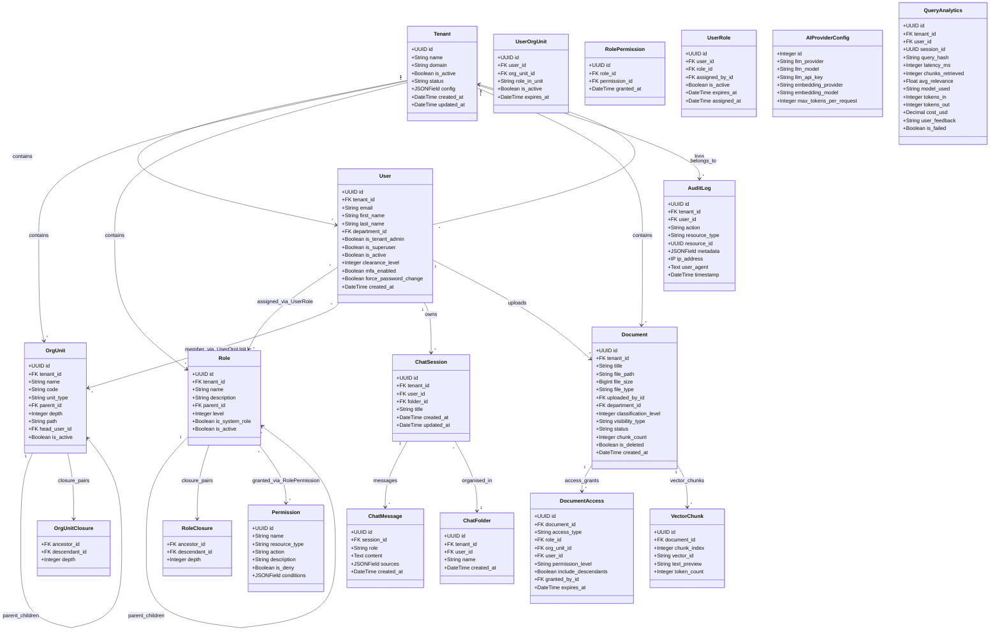
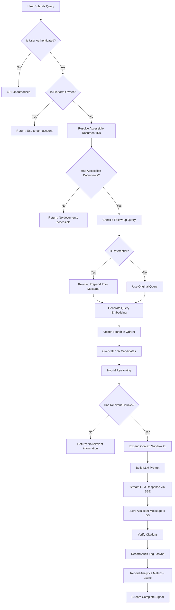
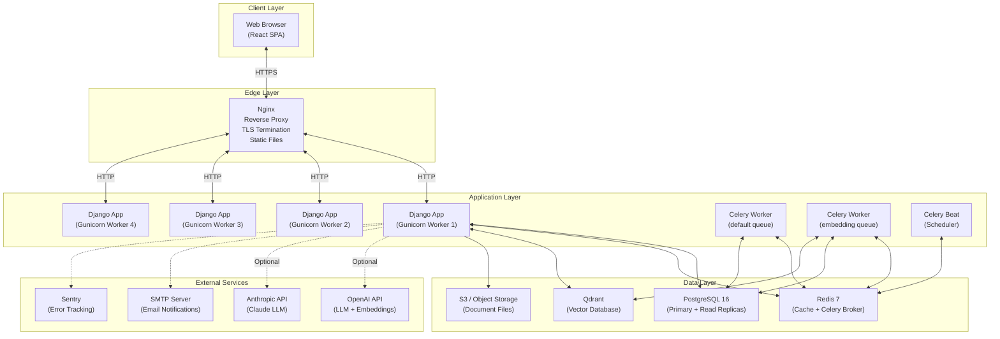
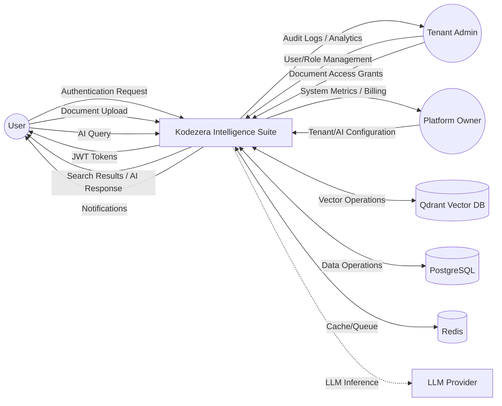
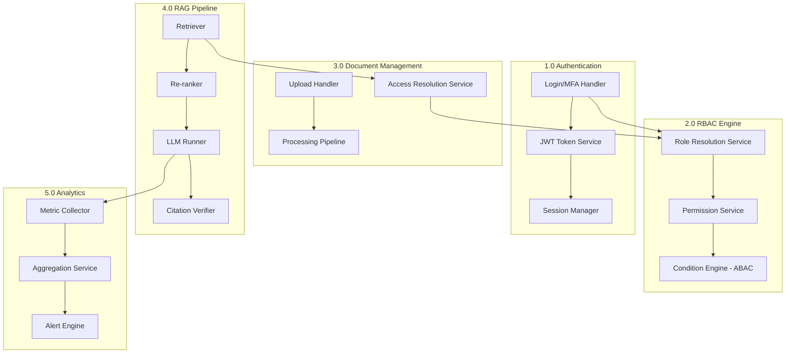
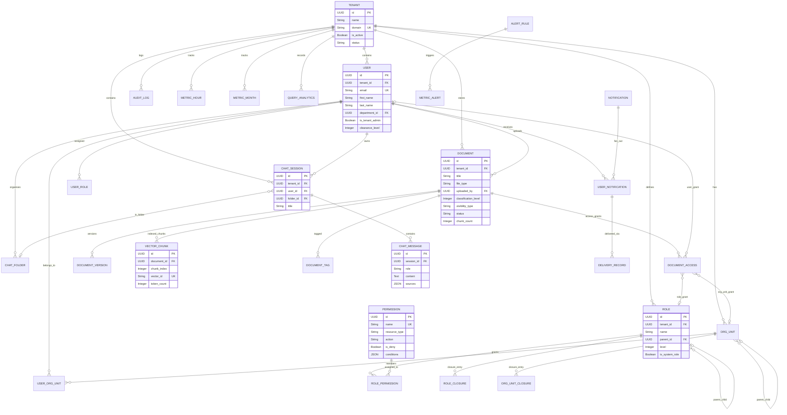

# Chapter 3: Analysis and Design (Part 2 — Diagrams, ERD, & Table Specifications)

---

## 3.3 Class Diagram

---

## 3.4 Activity Diagram — RAG Query Flow

---

## 3.5 Deployment Diagram

---

## 3.6 Data Flow Diagram (DFD)

### Level 0: Context Diagram

### Level 1: Subsystem Interaction

---

## 3.7 Entity-Relationship Diagram (ERD)

---

## 3.8 Table Specifications

### 3.8.1 Core Module Tables

#### Table: `tenants`

| Column | Type | Constraints | Description |
|--------|------|-------------|-------------|
| id | UUID | PK, DEFAULT uuid4 | Unique tenant identifier |
| name | VARCHAR(255) | NOT NULL | Organisation display name |
| domain | VARCHAR(255) | UNIQUE, NOT NULL | Unique domain slug |
| is_active | BOOLEAN | DEFAULT TRUE | Tenant active status |
| status | VARCHAR(20) | DEFAULT 'created' | Onboarding status (created, configured, active, suspended) |
| config | JSONB | DEFAULT {} | Tenant-specific configuration |
| max_users | INTEGER | DEFAULT 50 | User seat limit |
| max_storage_gb | INTEGER | DEFAULT 10 | Storage quota |
| created_at | TIMESTAMP | AUTO | Creation timestamp |
| updated_at | TIMESTAMP | AUTO | Last modification timestamp |

**Indexes**: `(domain)` UNIQUE, `(is_active)`, `(status)`

#### Table: `users` (extends Django AbstractBaseUser)

| Column | Type | Constraints | Description |
|--------|------|-------------|-------------|
| id | UUID | PK, DEFAULT uuid4 | Unique user identifier |
| tenant_id | UUID | FK → tenants.id, NULL | Parent tenant (NULL for Platform Owner) |
| email | VARCHAR(254) | UNIQUE, NOT NULL | Login email |
| username | VARCHAR(150) | NOT NULL | Display username |
| first_name | VARCHAR(150) | | User first name |
| last_name | VARCHAR(150) | | User last name |
| department_id | UUID | FK → departments.id, NULL | Legacy department reference |
| password | VARCHAR(128) | NOT NULL | Hashed password (bcrypt) |
| is_tenant_admin | BOOLEAN | DEFAULT FALSE | Tenant administrator flag |
| is_superuser | BOOLEAN | DEFAULT FALSE | Platform owner flag |
| is_active | BOOLEAN | DEFAULT TRUE | Account active status |
| clearance_level | INTEGER | DEFAULT 0 | Document classification clearance (0–5) |
| mfa_enabled | BOOLEAN | DEFAULT FALSE | Multi-factor authentication enabled |
| mfa_secret | VARCHAR(32) | NULL | TOTP shared secret |
| force_password_change | BOOLEAN | DEFAULT FALSE | Force password change on next login |
| failed_login_attempts | INTEGER | DEFAULT 0 | Consecutive failed login count |
| last_failed_login | TIMESTAMP | NULL | Last failed login timestamp |
| created_at | TIMESTAMP | AUTO | Account creation timestamp |
| updated_at | TIMESTAMP | AUTO | Last modification timestamp |

**Indexes**: `(email)` UNIQUE, `(tenant_id, is_active)`, `(tenant_id, department_id)`

#### Table: `org_units`

| Column | Type | Constraints | Description |
|--------|------|-------------|-------------|
| id | UUID | PK | Unit identifier |
| tenant_id | UUID | FK → tenants.id | Parent tenant |
| name | VARCHAR(255) | NOT NULL | Unit display name |
| code | VARCHAR(50) | | Short code (unique per tenant when non-empty) |
| unit_type | VARCHAR(20) | DEFAULT 'department' | Type: company, division, department, team, cost_center, location |
| parent_id | UUID | FK → org_units.id, NULL | Parent unit (self-referential) |
| depth | INTEGER | DEFAULT 0 | Hierarchy depth (0 = root) |
| path | VARCHAR(1000) | | Materialised path for ordering |
| head_id | UUID | FK → users.id, NULL | Unit head |
| is_active | BOOLEAN | DEFAULT TRUE | Active status |
| metadata | JSONB | DEFAULT {} | Custom metadata |

**Indexes**: `(tenant_id, unit_type)`, `(tenant_id, parent_id)`, `(path)`
**Constraints**: MAX_DEPTH = 15; parent must belong to same tenant

#### Table: `org_unit_closure`

| Column | Type | Constraints | Description |
|--------|------|-------------|-------------|
| ancestor_id | UUID | FK → org_units.id | Ancestor node |
| descendant_id | UUID | FK → org_units.id | Descendant node |
| depth | INTEGER | NOT NULL | Distance between ancestor and descendant (0 = self) |

**Indexes**: `(descendant_id, depth)`, `(ancestor_id, depth)`
**Constraints**: UNIQUE(ancestor_id, descendant_id)

### 3.8.2 RBAC Module Tables

#### Table: `roles`

| Column | Type | Constraints | Description |
|--------|------|-------------|-------------|
| id | UUID | PK | Role identifier |
| tenant_id | UUID | FK → tenants.id | Owning tenant |
| name | VARCHAR(100) | NOT NULL | Role display name |
| description | TEXT | | Role description |
| parent_id | UUID | FK → roles.id, NULL | Parent role for hierarchy |
| level | INTEGER | DEFAULT 0 | Hierarchy level (0 = top) |
| is_system_role | BOOLEAN | DEFAULT FALSE | System-generated, non-deletable |
| is_active | BOOLEAN | DEFAULT TRUE | Active status |

**Indexes**: `(tenant_id, is_active)`, `(tenant_id, is_system_role)`
**Constraints**: UNIQUE(tenant_id, name); system roles cannot be modified/deleted

#### Table: `permissions`

| Column | Type | Constraints | Description |
|--------|------|-------------|-------------|
| id | UUID | PK | Permission identifier |
| name | VARCHAR(200) | UNIQUE | Human-readable permission name |
| resource_type | VARCHAR(50) | NOT NULL | Resource category (document, user, role, rag, etc.) |
| action | VARCHAR(50) | NOT NULL | Action verb (create, read, update, delete, upload, query) |
| description | TEXT | | Explanation of what this permission grants |
| is_deny | BOOLEAN | DEFAULT FALSE | If TRUE, this is an explicit deny rule |
| conditions | JSONB | DEFAULT {} | ABAC condition object |

**Indexes**: `(resource_type, action)`, `(is_deny)`
**Constraints**: UNIQUE(resource_type, action, is_deny)

#### Table: `role_closure`

| Column | Type | Constraints | Description |
|--------|------|-------------|-------------|
| ancestor_id | UUID | FK → roles.id | Ancestor role |
| descendant_id | UUID | FK → roles.id | Descendant role |
| depth | INTEGER | NOT NULL | Hierarchy distance |

**Indexes**: `(descendant_id, depth)`, `(ancestor_id)`
**Constraints**: UNIQUE(ancestor_id, descendant_id)

### 3.8.3 Document Module Tables

#### Table: `documents`

| Column | Type | Constraints | Description |
|--------|------|-------------|-------------|
| id | UUID | PK | Document identifier |
| tenant_id | UUID | FK → tenants.id | Owning tenant |
| title | VARCHAR(500) | NOT NULL | Document title |
| file_path | VARCHAR(1000) | NOT NULL | Storage path |
| file_size | BIGINT | NOT NULL | File size in bytes |
| file_type | VARCHAR(20) | NOT NULL | File extension (.pdf, .docx, etc.) |
| uploaded_by_id | UUID | FK → users.id | Uploader reference |
| department_id | UUID | FK → departments.id, NULL | Legacy department association |
| classification_level | INTEGER | DEFAULT 0 | Security classification (0–5) |
| visibility_type | VARCHAR(20) | DEFAULT 'restricted' | public, restricted, or private |
| status | VARCHAR(20) | DEFAULT 'pending' | Processing status (pending, processing, completed, failed) |
| chunk_count | INTEGER | DEFAULT 0 | Number of vector chunks created |
| processing_error | TEXT | | Error message if processing failed |
| version | INTEGER | DEFAULT 1 | Current version number |
| is_deleted | BOOLEAN | DEFAULT FALSE | Soft delete flag |
| deleted_at | TIMESTAMP | NULL | Soft delete timestamp |

**Indexes**: `(tenant_id, status)`, `(tenant_id, visibility_type)`, `(uploaded_by_id)`

#### Table: `document_access`

| Column | Type | Constraints | Description |
|--------|------|-------------|-------------|
| id | UUID | PK | Grant identifier |
| document_id | UUID | FK → documents.id | Target document |
| access_type | VARCHAR(20) | NOT NULL | Grant type: role, org_unit, user |
| role_id | UUID | FK → roles.id, NULL | Role reference (for type='role') |
| org_unit_id | UUID | FK → org_units.id, NULL | Org unit reference (for type='org_unit') |
| user_id | UUID | FK → users.id, NULL | User reference (for type='user') |
| permission_level | VARCHAR(10) | DEFAULT 'read' | read, write, or manage |
| include_descendants | BOOLEAN | DEFAULT FALSE | Cascade to descendant org units |
| granted_by_id | UUID | FK → users.id | Who created the grant |
| expires_at | TIMESTAMP | NULL | Optional expiration |

**Indexes**: `(document_id, access_type)`, `(role_id)`, `(org_unit_id)`, `(user_id)`

---
