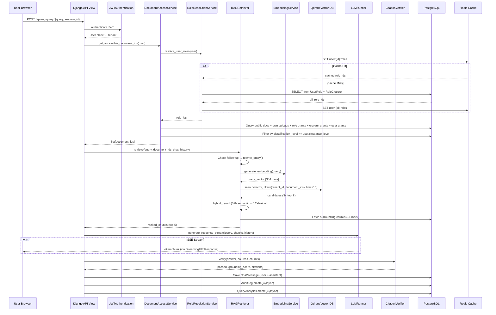
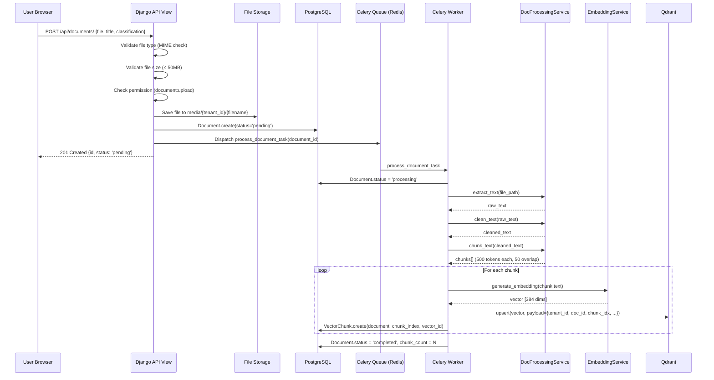
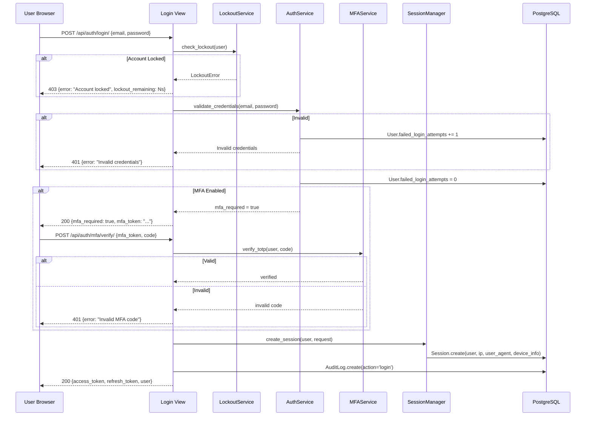

# Chapter 3 (Continued): Sequence Diagrams & RBAC Deep-Dive

---

## 3.9 Sequence Diagrams

### 3.9.1 RAG Query Execution Sequence



### 3.9.2 Document Upload & Processing Sequence



### 3.9.3 Authentication + MFA Sequence



---

## 3.10 RBAC Architecture Deep-Dive

### 3.10.1 Closure Table Mechanics

The closure table is the core data structure that enables O(1) ancestor/descendant queries for hierarchical roles. For a role hierarchy:

```
        CEO (Level 0)
        ├── VP Engineering (Level 1)
        │   ├── Tech Lead (Level 2)
        │   └── Senior Dev (Level 2)
        └── VP Sales (Level 1)
            └── Sales Manager (Level 2)
```

The `role_closure` table contains:

| ancestor | descendant | depth |
|----------|-----------|-------|
| CEO | CEO | 0 |
| VP_Eng | VP_Eng | 0 |
| VP_Eng | CEO | 1 |
| TechLead | TechLead | 0 |
| TechLead | VP_Eng | 1 |
| TechLead | CEO | 2 |
| SeniorDev | SeniorDev | 0 |
| SeniorDev | VP_Eng | 1 |
| SeniorDev | CEO | 2 |
| VP_Sales | VP_Sales | 0 |
| VP_Sales | CEO | 1 |
| SalesMgr | SalesMgr | 0 |
| SalesMgr | VP_Sales | 1 |
| SalesMgr | CEO | 2 |

**Query: "What roles does a user assigned to TechLead inherit?"**
```sql
SELECT ancestor_id FROM role_closure WHERE descendant_id = 'TechLead';
-- Returns: {TechLead, VP_Eng, CEO}  ← Single query, O(1)
```

**Query: "Who are all descendants of VP_Sales?"**
```sql
SELECT descendant_id FROM role_closure WHERE ancestor_id = 'VP_Sales';
-- Returns: {VP_Sales, SalesMgr}
```

### 3.10.2 Permission Resolution Algorithm (Formal)

```
FUNCTION has_permission(user, resource_type, action, context):
    # Step 1: Bypass for superusers and tenant admins
    IF user.is_superuser OR user.is_tenant_admin:
        RETURN TRUE

    # Step 2: Resolve all effective roles (direct + inherited)
    role_ids ← CLOSURE_QUERY(user.direct_roles)

    # Step 3: Get matching permissions
    perms ← SELECT * FROM permissions
             WHERE resource_type = input.resource_type
               AND action = input.action
               AND id IN (SELECT permission_id FROM role_permissions
                          WHERE role_id IN role_ids)

    # Step 4: DENY-FIRST evaluation
    FOR perm IN perms WHERE perm.is_deny = TRUE:
        IF perm.conditions IS EMPTY:
            RETURN FALSE   # Unconditional deny
        ELSE IF evaluate_conditions(perm.conditions, context):
            RETURN FALSE   # Conditional deny matched

    # Step 5: ALLOW evaluation
    FOR perm IN perms WHERE perm.is_deny = FALSE:
        IF perm.conditions IS EMPTY:
            RETURN TRUE    # Unconditional allow
        ELSE IF evaluate_conditions(perm.conditions, context):
            RETURN TRUE    # Conditional allow matched

    # Step 6: Default deny
    RETURN FALSE
```

### 3.10.3 ABAC Condition Engine

The `conditions` field on `Permission` supports a JSON-based condition language:

```json
{
    "department": "own",
    "classification_level": {"lte": 3},
    "time_range": {"after": "09:00", "before": "18:00"}
}
```

The `ConditionEngine.evaluate()` method processes each key:

| Condition Key | Evaluation Logic |
|---------------|-----------------|
| `department: "own"` | `context.department_id == user.department_id` |
| `classification_level: {"lte": N}` | `context.classification_level <= N` |
| `classification_level: {"gte": N}` | `context.classification_level >= N` |
| `org_unit: "own_subtree"` | `context.org_unit_id IN descendants(user.org_unit_ids)` |
| `time_range: {"after", "before"}` | `current_time BETWEEN after AND before` |

### 3.10.4 Cache Invalidation Strategy

```
Django Signal: post_save on UserRole
    → Delete Redis key: user:{user_id}:roles
    → Delete Redis key: user:{user_id}:permissions

Django Signal: post_save on RolePermission
    → Find all users with this role_id (direct + via closure descendants)
    → Delete their Redis permission cache keys

Django Signal: post_delete on UserRole
    → Same as post_save (cache bust)

Result: Permission changes take effect IMMEDIATELY
        No stale data; no TTL-based eventual consistency
```

---

## 3.11 Data Security Architecture

### 3.11.1 Multi-Layer Security Model

```
Layer 1: Network Security
  ├── TLS 1.2+ (HTTPS enforcement via HSTS)
  ├── CORS whitelist (only configured origins)
  └── Firewall rules (only 80/443 exposed)

Layer 2: Authentication
  ├── JWT with RS256/HS256 signing
  ├── Refresh token rotation (old token blacklisted)
  ├── MFA (TOTP + Email OTP)
  └── Account lockout (N failed attempts)

Layer 3: Authorisation
  ├── Tenant isolation (middleware-level)
  ├── RBAC permission checks (view-level)
  ├── ABAC condition evaluation (context-level)
  └── Document classification enforcement (data-level)

Layer 4: Data Protection
  ├── UUID primary keys (no sequential IDs)
  ├── Parameterised queries (Django ORM, no raw SQL)
  ├── Input validation (Pydantic, Zod)
  └── XSS protection (React auto-escaping, CSP headers)

Layer 5: Audit & Compliance
  ├── Automatic write-operation logging
  ├── Hash-chain audit integrity
  ├── Immutable version snapshots
  └── Compliance reporting endpoints
```

### 3.11.2 JWT Token Lifecycle

```
Login Request → Validate Credentials → (Optional MFA) →
Issue Access Token (TTL: 1 hour) + Refresh Token (TTL: 24 hours) →
Client stores in memory (access) + httpOnly cookie (refresh) →
Every API request: Bearer {access_token} →
On 401: POST /refresh/ with refresh_token →
    Old refresh token blacklisted →
    New access + refresh tokens issued →
    Client updates stored tokens
Logout: Blacklist refresh token; client clears storage
```

---
