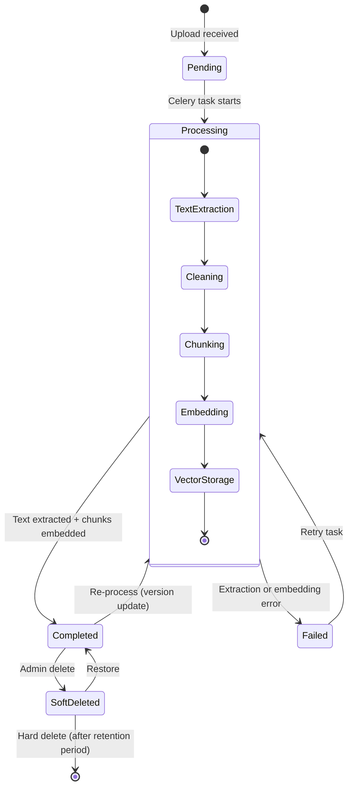
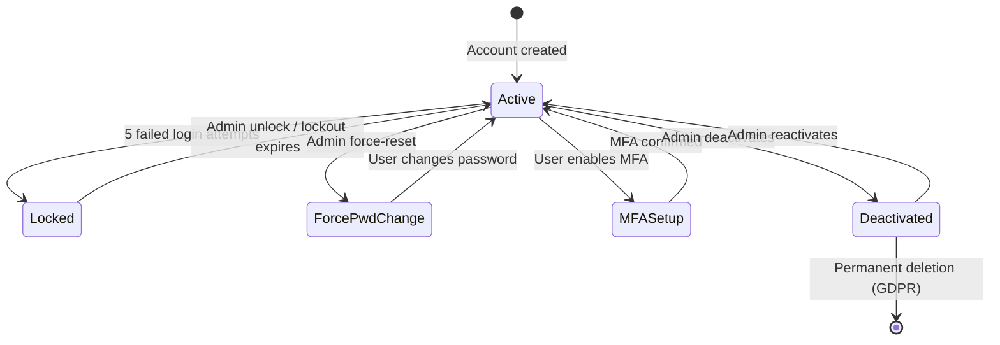
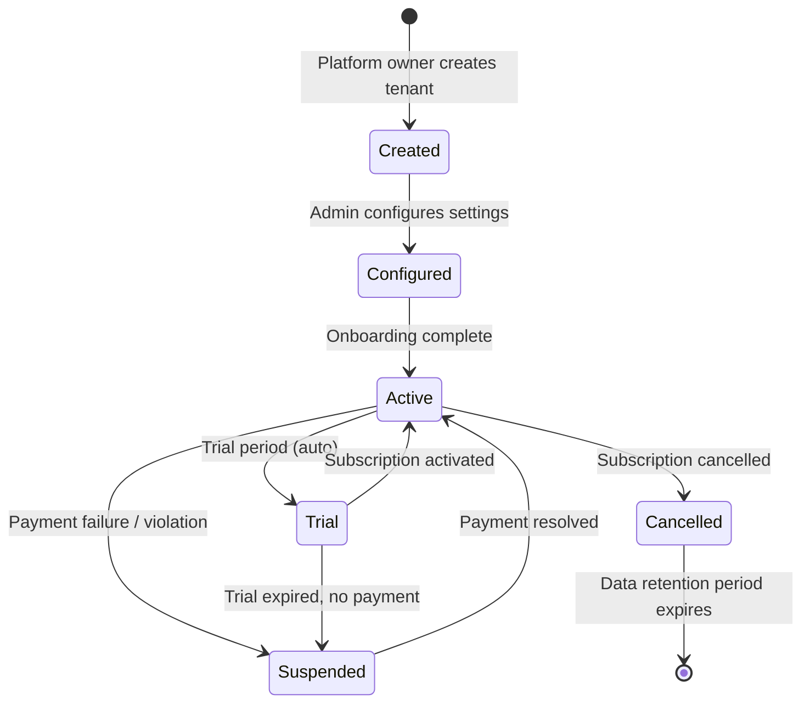
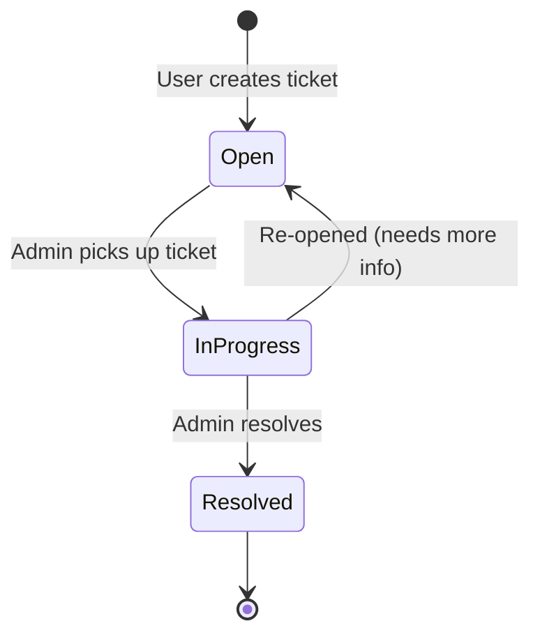
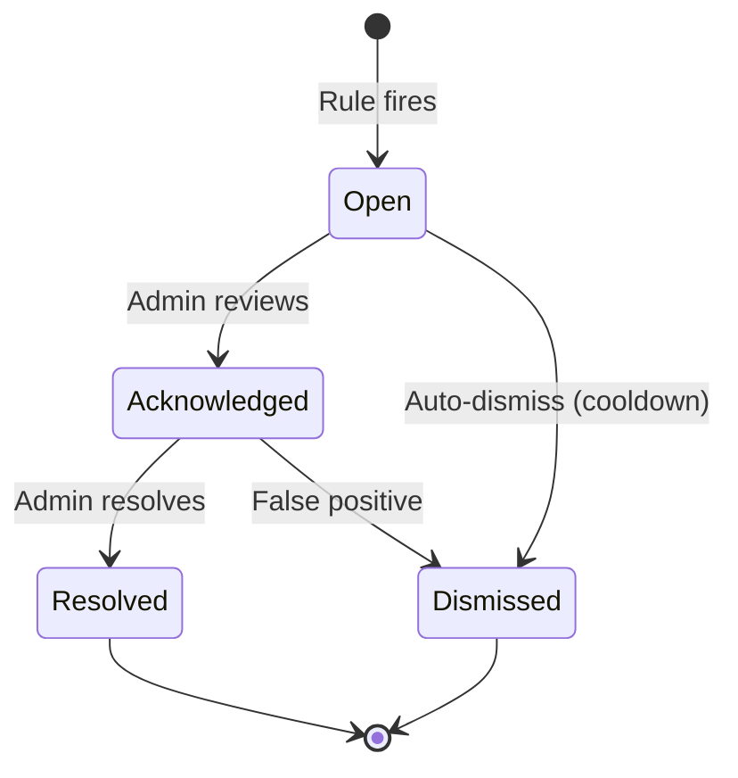

# Chapter 11: State Machines, Risk Analysis, and Advanced Algorithms

---

## 11.1 State Machine Diagrams

### 11.1.1 Document Lifecycle



### 11.1.2 User Account States



### 11.1.3 Tenant Lifecycle



### 11.1.4 Support Ticket Lifecycle



### 11.1.5 Security Alert Lifecycle



---

## 11.2 Security Detection Rules

The `SecurityDetectionService` evaluates 7 predefined rules against every audit event:

| Rule Key | Severity | Trigger | Window | Threshold |
|----------|:--------:|---------|:------:|:---------:|
| `brute_force_login` | **HIGH** | Failed login from same IP | 5 min | 5 attempts |
| `privilege_escalation` | **CRITICAL** | `grant_access` action detected | — | Instant |
| `mass_data_access` | **HIGH** | Excessive read operations | 5 min | 100 reads |
| `bulk_delete` | **HIGH** | Excessive delete operations | 5 min | 10 deletes |
| `admin_action_burst` | **MEDIUM** | Unusual admin activity volume | 10 min | 15 actions |
| `off_hours_activity` | **LOW** | Sensitive ops outside 06:00–22:00 | — | Instant |
| `config_change` | **MEDIUM** | System config modification | — | Instant |

### 11.2.1 Sliding Window Algorithm (Redis-based)

```python
def _check_threshold(rule, event):
    # Build unique counter key per user+rule (or IP for login)
    if event.action == 'login':
        counter_key = f"sec:{rule['key']}:{event.ip_address}"
    else:
        actor_id = str(event.user_id) if event.user_id else event.ip_address
        counter_key = f"sec:{rule['key']}:{event.tenant_id}:{actor_id}"

    # Increment Redis counter with TTL = window_seconds
    count = cache.get(counter_key, 0) + 1
    cache.set(counter_key, count, timeout=rule['window_seconds'])

    if count >= rule['threshold']:
        # Dedup: skip if open/acknowledged alert exists for this rule
        existing = SecurityAlert.objects.filter(
            rule_key=rule['key'], tenant_id=event.tenant_id,
            status__in=['open', 'acknowledged'],
            created_at__gte=now() - timedelta(seconds=window * 2),
        ).exists()
        if not existing:
            SecurityAlert.create(rule, event)
```

---

## 11.3 Circuit Breaker Pattern

The system protects against cascading failures from downstream services (LLM APIs, Qdrant, email) using a Redis-backed circuit breaker:

```
┌──────────┐    success    ┌──────────┐
│  CLOSED  │──────────────▶│  CLOSED  │ (normal traffic)
│          │               └──────────┘
│          │    failure
│          │──────count──▶ failure_count++
│          │
│          │──── threshold ▶┌──────────┐
└──────────┘               │   OPEN   │ (fail fast, no calls)
                           │          │
                           │  wait    │
                           │  30s     │
                           │          │
                           └────┬─────┘
                                │ recovery_timeout elapsed
                                ▼
                           ┌──────────┐
                           │HALF_OPEN │ (single trial request)
                           │          │
                           ├─success──▶ CLOSED (reset counter)
                           └─failure──▶ OPEN   (restart timer)
```

**Configuration**:
- `failure_threshold`: 5 consecutive failures to trip the breaker
- `recovery_timeout_seconds`: 30 seconds before a trial request is allowed
- **State storage**: Redis cache with 24-hour TTL

---

## 11.4 Risk Analysis Matrix

### 11.4.1 Technical Risks

| # | Risk | Probability | Impact | Severity | Mitigation |
|---|------|:-----------:|:------:|:--------:|------------|
| R-01 | LLM provider outage (OpenAI, Anthropic) | Medium | High | **HIGH** | Multi-provider fallback chain; local model support |
| R-02 | Qdrant vector DB data loss | Low | Critical | **HIGH** | Persistent volumes; snapshots; re-embedding from source documents |
| R-03 | Redis failure (cache + queues) | Low | High | **MEDIUM** | Redis persistence (RDB); Sentinel for HA; graceful degradation |
| R-04 | PostgreSQL data corruption | Very Low | Critical | **MEDIUM** | WAL archiving; point-in-time recovery; daily backups |
| R-05 | Embedding model change breaks retrieval | Medium | Medium | **MEDIUM** | Store embedding_model per VectorChunk; version-aware search |
| R-06 | JWT secret key compromise | Very Low | Critical | **HIGH** | Key rotation mechanism; short token lifetimes; refresh blacklisting |
| R-07 | Celery queue backpressure | Medium | Medium | **MEDIUM** | Queue isolation (default vs embedding); monitoring alerts |
| R-08 | Cross-tenant data leakage | Very Low | Critical | **CRITICAL** | Middleware isolation; scoped ORM querysets; integration tests |
| R-09 | DDoS on RAG query endpoint | Medium | High | **HIGH** | 3-layer rate limiting; Cloudflare; K8s HPA |
| R-10 | Model hallucination in answers | High | Medium | **HIGH** | Citation verification; grounding score threshold; source display |

### 11.4.2 Operational Risks

| # | Risk | Probability | Impact | Severity | Mitigation |
|---|------|:-----------:|:------:|:--------:|------------|
| R-11 | Disk space exhaustion | Medium | High | **HIGH** | Storage quota enforcement; monitoring alerts; auto-cleanup |
| R-12 | Audit log table growth | High | Low | **LOW** | Partitioning by month; configurable retention policies |
| R-13 | Tenant admin error (bulk delete) | Medium | High | **HIGH** | Soft-delete only; 30-day retention; RBAC prevents casual access |
| R-14 | Stale permission cache | Low | Medium | **MEDIUM** | Signal-based cache invalidation (immediate); 1-hour TTL fallback |
| R-15 | Embedding pipeline bottleneck | Medium | Medium | **MEDIUM** | Dedicated Celery queue with limited concurrency; batch processing |

---

## 11.5 Performance Projections

### 11.5.1 Capacity Estimates (per K8s pod)

| Operation | Estimated Throughput | Latency (p50) | Latency (p95) |
|-----------|:-------------------:|:-------------:|:-------------:|
| Login (JWT issuance) | ~200 req/s | 15ms | 40ms |
| Document list (paginated) | ~500 req/s | 8ms | 25ms |
| Permission check (cached) | ~10,000 checks/s | <1ms | 2ms |
| Permission check (uncached) | ~500 checks/s | 12ms | 30ms |
| RAG query (end-to-end) | ~5 req/s | 2,000ms | 5,000ms |
| Document upload + processing | ~2 docs/min | N/A (async) | N/A |
| Embedding generation (local) | ~10 chunks/s | 100ms | 200ms |
| Qdrant vector search | ~100 req/s | 15ms | 40ms |

### 11.5.2 Scaling Recommendations

| Concurrent Users | Backend Pods | Celery Default | Celery Embedding | Database |
|:----------------:|:------------:|:--------------:|:----------------:|----------|
| 1–50 | 2 | 1 (concurrency=4) | 1 (concurrency=2) | Single PG |
| 50–200 | 4 | 2 (concurrency=4) | 2 (concurrency=2) | PG + PgBouncer |
| 200–500 | 6 | 3 (concurrency=6) | 3 (concurrency=2) | PG Primary + Read Replica |
| 500–2000 | 8 | 4 (concurrency=8) | 4 (concurrency=4) | PG HA Cluster |

---

## 11.6 Celery Task Catalogue

| Task | Queue | Description | Trigger |
|------|-------|-------------|---------|
| `process_document` | `embedding` | Extract text, chunk, embed, store in Qdrant | Document upload |
| `reprocess_document` | `embedding` | Re-embed document after model change | Admin action |
| `send_notification_email` | `default` | Send email for notification delivery | Notification dispatch |
| `send_notification_push` | `default` | Send browser push notification | Notification dispatch |
| `compute_hourly_metrics` | `default` | Aggregate QueryAnalytics into MetricHour | Celery Beat (hourly) |
| `compute_monthly_metrics` | `default` | Roll up MetricHour into MetricMonth | Celery Beat (1st of month) |
| `evaluate_alert_rules` | `default` | Check MetricHour against AlertRule thresholds | Celery Beat (hourly) |
| `cleanup_expired_sessions` | `default` | Remove expired UserSession records | Celery Beat (daily) |
| `cleanup_audit_logs` | `default` | Archive audit logs past retention period | Celery Beat (daily) |
| `generate_tenant_invoices` | `default` | Generate monthly invoices from usage data | Celery Beat (1st of month) |
| `health_check_all` | `default` | Probe all system components and log results | Celery Beat (5 min) |

---

## 11.7 Quota Enforcement Algorithm

```python
class QuotaService:
    @staticmethod
    def check_queries(tenant_id):
        plan = TenantSubscription.objects.filter(
            tenant_id=tenant_id
        ).select_related('plan').first().plan

        daily_limit = plan.max_queries_per_month // 30
        used_today = MeteringService.get_queries(tenant_id)  # Redis counter

        if used_today >= daily_limit:
            raise QuotaExceeded(
                resource='queries',
                limit=daily_limit,
                used=used_today,
                reset_at=tomorrow_iso()
            )
    # Also: check_tokens(), check_storage(), check_users()
```

**Response on quota exceeded**:
```json
{
    "error": "quota_exceeded",
    "resource": "queries",
    "limit": 16,
    "used": 17,
    "reset_at": "2026-04-04"
}
```

---
